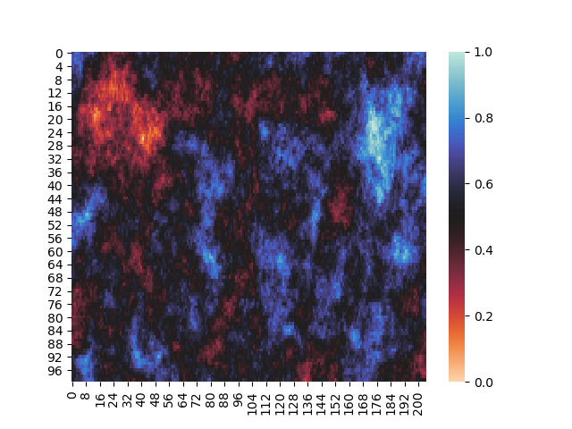
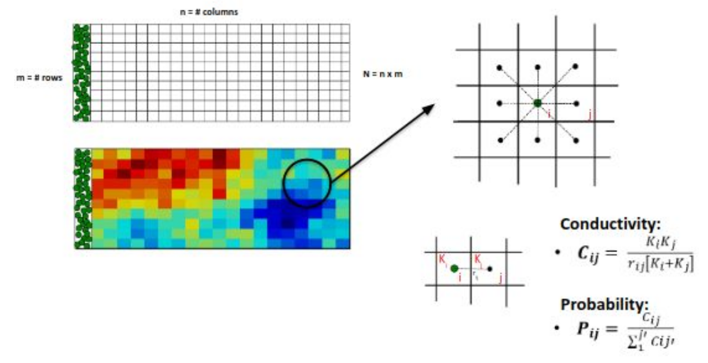
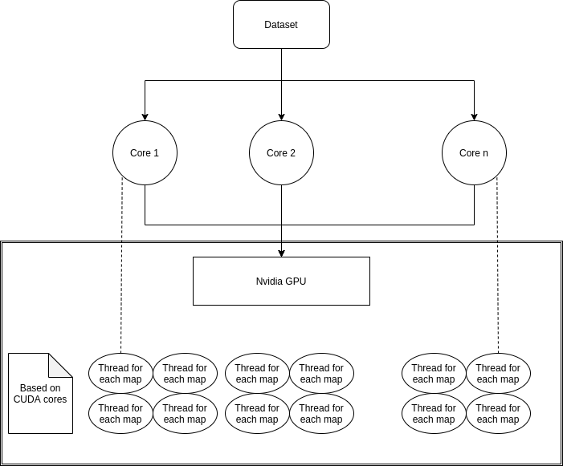
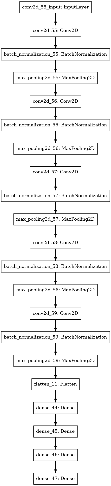

# Estimating Late Arrival Time for a Hydraulic Conductivity Map

Exploring different techniques to get insights from Hydraulic conductivity map for a relationship between t_95.

- HCM : Hydraulic Conductivity Map

## Introduction

***



## Previous Work

***

### Research Papers

1. [Seeing macro-dispersivity from hydraulic conductivity field with convolutional neural network](https://www.sciencedirect.com/science/article/abs/pii/S0309170819308607)
2. [Minimum Hydraulic Resistance and Least Resistance Path in Heterogeneous Porous Media](https://agupubs.onlinelibrary.wiley.com/doi/full/10.1002/2017WR020418)

## Approach

***

## Probabilistic path estimation

***



- We define the tendency of the contaminant to pass from the cell i to one of the 8 neighbor cells j as CONDUCTIVITY, ​ **C_ij**, where rij is the distance between the two cells and Ki and Kj are the hydraulic conductivity of the considered cells. While, ​ **P_ij** ​ is the probability that the contaminant contained in the i-th cell moves in the j-th cell (that is one of the 8 cells around i).

- To generate data for all the maps in dataset it takes >2 minutes.
- To improve the performance we parallelized the code using OMP and OpenMP, based on the below structure to generate probilistic paths.



## Comparing t_95 of different HCM

***



- We create a DNN (deep neural network) with a combination of CNN (convolution neural network) and fully connected layer.
- Below is the model summary,

```bash
Model: "sequential"
_________________________________________________________________
Layer (type)                 Output Shape              Param #
=================================================================
conv2d (Conv2D)              (None, 50, 103, 16)       800
_________________________________________________________________
batch_normalization (BatchNo (None, 50, 103, 16)       64
_________________________________________________________________
max_pooling2d (MaxPooling2D) (None, 25, 51, 16)        0
_________________________________________________________________
conv2d_1 (Conv2D)            (None, 25, 51, 32)        25120
_________________________________________________________________
batch_normalization_1 (Batch (None, 25, 51, 32)        128
_________________________________________________________________
max_pooling2d_1 (MaxPooling2 (None, 12, 25, 32)        0
_________________________________________________________________
conv2d_2 (Conv2D)            (None, 12, 25, 64)        100416
_________________________________________________________________
batch_normalization_2 (Batch (None, 12, 25, 64)        256
_________________________________________________________________
max_pooling2d_2 (MaxPooling2 (None, 6, 12, 64)         0
_________________________________________________________________
conv2d_3 (Conv2D)            (None, 6, 12, 128)        401536
_________________________________________________________________
batch_normalization_3 (Batch (None, 6, 12, 128)        512
_________________________________________________________________
max_pooling2d_3 (MaxPooling2 (None, 3, 6, 128)         0
_________________________________________________________________
conv2d_4 (Conv2D)            (None, 3, 6, 256)         819456
_________________________________________________________________
batch_normalization_4 (Batch (None, 3, 6, 256)         1024
_________________________________________________________________
max_pooling2d_4 (MaxPooling2 (None, 1, 3, 256)         0
_________________________________________________________________
flatten (Flatten)            (None, 768)               0
_________________________________________________________________
dense (Dense)                (None, 256)               196864
_________________________________________________________________
dense_1 (Dense)              (None, 256)               65792
_________________________________________________________________
dense_2 (Dense)              (None, 256)               65792
_________________________________________________________________
dense_3 (Dense)              (None, 1)                 257
=================================================================
Total params: 1,678,017
Trainable params: 1,677,025
Non-trainable params: 992
_________________________________________________________________
```
